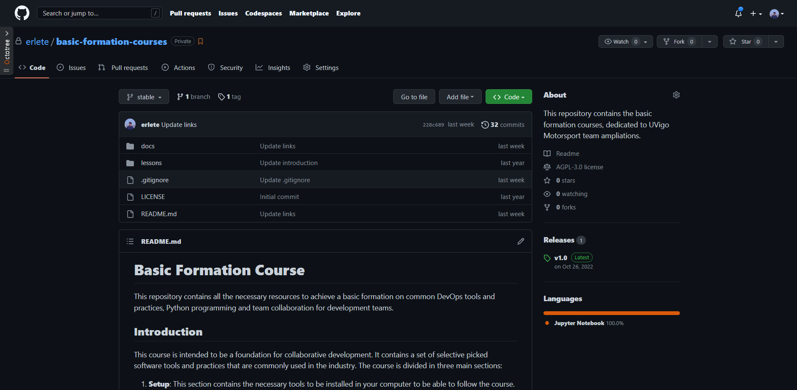

# GitHub

GitHub is an excellent collaboration tool for development teams and a great way to share your code with the world. It is also a great way to learn how to use Git, since it is the most popular Git repository hosting service.

The platform is based on the core functionality of the Git version control system, which will be studied in the following sections. Consider this tutorial as an interface for Git, but learn to differentiate between GitHub tools and Git functionality.

## GitHub Features

### Repository

A repository is the home for your code. It can be public or private, and it can contain as many files as you want (of course, with some limitations, such as individual file size and total repository size). It can also contain directories, which are used to organize said files.

### Commit

A commit represents any modification or set of modifications over a repository. It is the basic unit of change in Git, and it is used to track the history of a repository. A commit is made up of a commit message, which is a short description of the changes made, and the actual changes themselves.

### Branches

Branches are parallel versions of a given state of a repository. They are the key to collaborative development, since they allow multiple developers to work on the same repository without affecting each other. Branches are created from a given commit in another branch, and they can be merged back into the original branch when the work is done.

A main branch is always present on the repository, since if there were no branches, no commits could be made. This branch is called `master` by default, but it can be renamed to any other name. This is a good practice to avoid using the default name, since [it can be considered offensive for some people](https://www.theserverside.com/feature/Why-GitHub-renamed-its-master-branch-to-main).

```mermaid

%%{
    init: {
        'logLevel': 'debug',
        'theme': 'base',
        'gitGraph': {
            'showBranches': true,
            'showCommitLabel':true,
            'mainBranchName': 'stable'
        }
    }
}%%

gitGraph
    commit id: "commit 1.1"
    commit id: "commit 1.2"
    branch dev
    checkout dev
    commit id: "commit 2.1"
    commit id: "commit 2.2"
    checkout stable
    merge dev id: "merged branch"
    commit id: "commit 1.3"
    commit id: "commit 1.4"
    commit id: "commit 1.5"
    commit id: "commit 1.6"
    commit id: "commit 1.7"
```

Commits are named using hashes in order to generate a unique identification for each one of them.

```mermaid

%%{
    init: {
        'logLevel': 'debug',
        'theme': 'base',
        'gitGraph': {
            'showBranches': true,
            'showCommitLabel':true,
            'mainBranchName': 'stable'
        }
    }
}%%

gitGraph
    commit
    commit
    branch dev
    checkout dev
    commit
    commit
    checkout stable
    merge dev
    commit
    commit
    commit
    commit
    commit
```

It is also a good practice to have multiple branches such as `stable` and `dev`. The first one is used for stable code releases, while the second is used for development practices. This way, the stable branch is always ready for production, while the development branch is used to test new features and bug fixes.

```mermaid
%%{
    init: {
        'logLevel': 'debug',
        'theme': 'base',
        'gitGraph': {
            'showBranches': true,
            'showCommitLabel': true,
            'mainBranchName': 'stable'
        }
    }
}%%

gitGraph
    commit id: "initial-commit-1"

    branch dev
    commit id: "initial commit-2"

    branch camera-software-installation
    commit
    commit

    checkout dev
    branch mpc-development
    commit
    commit

    checkout camera-software-installation
    commit

    checkout dev
    merge mpc-development

    commit id: "actions-update-1"

    checkout camera-software-installation
    commit

    merge dev

    checkout dev
    merge camera-software-installation
    commit id: "actions-update-2"

    checkout stable
    merge dev
    commit id: "actions-update-3"

    checkout dev
    merge stable

    branch slam-investigation
    commit
    commit
    commit

    checkout dev
    merge slam-investigation

    commit id: "actions-update-4"

    checkout stable
    merge dev

    commit id: "actions-update-5"
```

### Forks

A fork is a copy of a repository. It is used to create a copy of a repository in your own account, so you can make changes to it without affecting the original repository. This is a great way to contribute to open-source projects, or even to create your own version of a project.

Any repository can be forked as long as the user has access to it. Forking a repository is as simple as clicking the "Fork" button in the top-right corner of the repository page.

Clicking that button will cause a new window to open, asking for details on how to fork the repository. The default options are usually fine, but you can change them if you want. Note that you cannot fork a repository into the same account it belongs to.

The *"Copy only the `<branch>` branch only"* option can be used to only fork the main branch of the repository.
